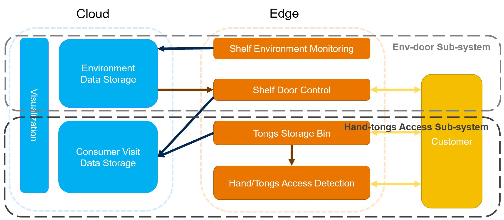

# Smart bakery shelf IoT system demonstrator
## UCL ELEC0130 Group_3 IoT_System final assignment
The program files of Arduino codes are placed here.

The system is divided into two sub-systems and each is deployed in one Arduino MKR WIFI 1010, the Env-door Sub-system and Hand-tongs Access Sub-system

To run this code on arduino, please check the pin set up in .ino file.

The wifi connection is required to synchronize the collected data to cloud storage. To implement this, add the Wifi ID and password in arduino_secrets.h

Set up example:

#define SECRET_SSID "iQOO Neo5_jin"
#define SECRET_PASS "hc3ju3wx"
